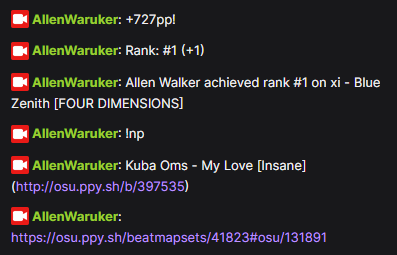

# About

This is a Twitch chat bot to reply commands (!np, !skin, etc), send beatmap requests from twitch to you ingame and to send osu status update (pp, rank and map rank)

Intial idea and code base from [Ceiling Waffle's osu-np](https://bitbucket.org/ceilingwaffle/osu-np/src/master), feel free to help the project by improving the code, my discord: `reklawnella`

# Examples



# Requirements
- NodeJS from https://nodejs.org/en/download/

# Installation
- Download the zip from this [repository](https://github.com/reklaWnellA/Twitch-Osu-Stats/archive/refs/heads/master.zip)
- Extract to a folder somewhere
- Press win+R to open the run window
- type: cmd
- In the console window, type:
```
cd <folder path where you extracted the zip file>
```
- Install the required NodeJS modules:
```
npm install
```
- Rename the file .env.example to .env
- Open .env in notepad and modify with your settings.
  - TWITCH_OAUTH_PASSWORD [here](https://twitchapps.com/tmi)
  - OSU_OAUTH_CLIENT you will need to [register an OAuth application](https://osu.ppy.sh/home/account/edit#new-oauth-application)
  - OSU_IRC [in your account settings](https://osu.ppy.sh/home/account/edit#legacy-api)

# Before Running
Irc package has an error (probably because it is outdated)

Change the line `412` from `node_modules/irc/lib/irc.js` to:
```js
case 'rpl_whoischannels':
if (!message.args[2]) break
```

# Running
- Start the bot by launching `start.bat` or typing this in the cmd:
```
npm start
```

# TODO:
- [ ] check if theres an event (websocket) that can be used instead of getting osu status everytime